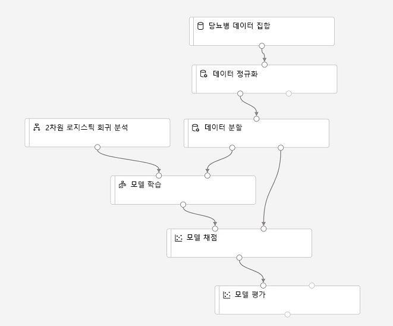

# 랩 2A: Azure ML Designer를 활용해 학습 파이프라인 만들기

*Designer* 인터페이스에서 제공되는 끌어서 놓기 환경을 통해 워크플로, 즉 기계 학습 모델을 만들기 위한 데이터 수집/변환/모델 학습 모듈의 *파이프라인*을 정의할 수 있습니다. 그런 다음 클라이언트 애플리케이션이 *유추*(새 데이터에서 예측 생성)에 사용할 수 있는 웹 서비스로 이 파이프라인을 게시할 수 있습니다.

> **참고**: 이 문서를 작성하는 시점에서 Azure Machine Learning Designer는 *미리 보기* 상태입니다. 따라서 예기치 않은 오류가 발생할 수 있습니다.

## 시작하기 전에

이 랩을 시작하기 전에 [랩 1A](Lab01A.md) 및 [랩 1B](Lab01B.md)를 완료해야 합니다. 이 두 랩에는 이 랩에서 사용되는 Azure Machine Learning 작업 영역 및 기타 리소스를 만드는 작업이 포함되어 있습니다. 그리고 다음 단계를 수행하여 이 랩에 필요한 컴퓨팅을 초기화합니다.

1. [Azure Machine Learning 스튜디오](https://ml.azure.com)의 **컴퓨팅** 페이지의 **컴퓨팅 클러스터** 탭에서 앞서 만든 컴퓨팅 클러스터의 이름을 클릭합니다.
2. 컴퓨팅 클러스터를 편집하여 **최소 노드 수**2로 변경하여 최소 노드 수와 최대 노드 수가 모두 2가 되도록 하고 **업데이트**를 클릭합니다. 그러면 클러스터 노드가 항상 실행되며 클러스터 노드가 시작될 때까지 기다리는 시간을 최소화합니다.

    > **중요**: 이 랩을 완료하지 않기로 결정한 경우 불필요한 비용이 발생하지 않도록 최소 노드 수를 0으로 재설정합니다.

## 작업 1: Designer 파이프라인 만들기 및 데이터 탐색

Designer 사용을 시작하려면 먼저 파이프라인을 만들고 사용할 데이터 세트를 추가해야 합니다.

1. 작업 영역의 [Azure Machine Learning Studio](https://ml.azure.com)에서 **Designer** 페이지를 표시하여 새 파이프라인을 만듭니다.
2. **설정** 창에서 기본 파이프라인 이름(*Pipeline-Created-on-*날짜***)을 **Visual Diabetes Training**으로 변경합니다. **설정** 창이 표시되어 있지 않으면 상단의 파이프라인 이름 옆에 있는 **&#9881;** 아이콘을 클릭합니다.
3. 파이프라인을 실행할 컴퓨팅 대상을 지정해야 합니다. **설정** 창에서 **컴퓨팅 대상 선택**을 클릭하고 컴퓨팅 클러스터를 선택합니다.
4. 디자이너 좌측에서 **데이터 세트**(&#8981;) 탭을 선택하고 **데이터 세트** 섹션을 확장한 다음 앞선 연습에서 만든 **diabetes dataset** 데이터 세트를 캔버스로 끌어서 놓습니다.
5. 캔버스에서 **당뇨병 데이터 집합** 모듈을 선택하고 설정을 확인합니다. 데이터 집합의 설정 창이 자동으로 열려 캔버스가 가려질 수 있습니다. 그런 다음 **출력** 탭에서 세로 막대형 차트 모양의 **시각화** 아이콘을 클릭합니다.
6. 데이터 스키마를 검토합니다. 여러 열의 분포가 히스토그램으로 표시됩니다. 그러면 시각화를 닫고 X 또는 **&#8599;&#8601;** 아이콘을 사용하여 데이터 세트가 있는 파이프라인 캔버스를 확인합니다.

## 작업 2: 변환 추가

모델 학습을 진행하려면 대개 데이터에 전처리 변환을 다소 적용해야 합니다.

1. 좌측 창에서 **모듈**(&#8862;) 탭을 확인하고 **데이터 변환** 섹션을 확장합니다. 이 섹션에는 모델 학습 전에 데이터를 변환하는 데 사용할 수 있는 광범위한 모듈이 포함되어 있습니다.
2. **데이터 일반화** 모듈을 캔버스의 **diabetes dataset** 모듈 아래로 끕니다. 그리고 **당뇨병 데이터 세트** 모듈의 출력을 **데이터 일반화** 모듈의 입력으로 연결합니다.
3. **데이터 일반화** 모듈을 선택하여 해당 설정을 확인합니다. 변환 방법과 변환할 열을 지정해야 합니다. 그런 다음 변환을 **ZScore**로 유지하고 열을 편집하여 다음 열 이름을 포함합니다.
    * PlasmaGlucose
    * DiastolicBloodPressure
    * TricepsThickness
    * SerumInsulin
    * BMI
    * DiabetesPedigree

    **참고**: 여기서는 숫자 열을 일반화하여 배율을 동일하게 설정하고 모델 학습에서 값이 큰 열만 주로 사용되는 현상을 방지하려고 합니다. 일반적으로는 이러한 전처리 변환을 다수 적용하여 학습용 데이터를 준비합니다. 하지만 이 연습에서는 간단한 변환 과정만 수행합니다.

4. 이제 데이터를 학습과 유효성 검사를 위한 개별 데이터 세트로 분할할 수 있습니다. 왼쪽 창의 **데이터 변환** 섹션에서 **데이터 분할** 모듈을 캔버스의 **데이터 일반화** 모듈 아래로 끕니다. 그런 다음 **데이터 일반화** 모듈의 *변환된 데이터 세트*(왼쪽) 출력을 **데이터 분할** 모듈의 입력에 연결합니다.
5. **데이터 분할** 모듈을 선택하고 해당 설정을 다음과 같이 구성합니다.
    * **분할 모드**: 행 분할
    * **첫 번째 출력 데이터 세트의 행 비율**: 0.7
    * **임의 초기값**: 123
    * **계층화된 분할**: False

## 작업 3: 모델 학습 모듈 추가

데이터를 준비하고 학습 및 유효성 검사 데이터 세트로 분할하고 나면 모델 학습 및 평가를 위해 파이프라인을 구성할 수 있습니다.

1. 왼쪽 창에서 **모델 학습** 섹션을 확장하고 **모델 학습** 모듈을 캔버스의 **데이터 분할** 모듈 아래로 끕니다. 그런 다음 **데이터 분할** 모듈의 *결과 데이터 세트1*(왼쪽) 출력을 **모델 학습** 모듈의 *데이터 세트*(오른쪽) 입력에 연결합니다.
2. 여기서는 **Diabetic** 값을 예측하는 모델의 학습을 진행할 것이므로, **모델 학습** 모듈을 선택한 다음 해당 설정을 수정하여 **레이블 열**을 **Diabetic**으로 설정합니다. 열 이름의 대/소문자와 철자를 정확하게 입력해야 합니다.
3. 이 모델이 예측할 **Diabetic** 레이블은 이진 열(당뇨 환자의 경우 1, 기타 환자의 경우 0)이므로 *분류* 알고리즘을 사용하여 모델을 학습시켜야 합니다. **기계 학습 알고리즘** 섹션을 확장하고 **분류**에서 **2클래스 로지스틱 회귀** 모듈을 캔버스의 **데이터 분할** 모듈 왼쪽/**모델 학습** 모듈 위로 끕니다. 그런 다음 이 모듈의 출력을 **모델 학습** 모듈의 **미학습 모델**(왼쪽) 입력에 연결합니다.
4. 학습된 모델을 테스트하려면 이 모델을 사용하여 원래 데이터를 분할할 때 별도로 저장해 둔 유효성 검사 데이터 세트의 점수를 매겨야 합니다. **모델 점수 매기기 및 평가** 섹션을 확장하고 **모델 점수 매기기** 모듈을 캔버스의 **모델 학습** 모듈 아래로 끕니다. 그런 다음 **모델 학습** 모듈의 출력을 **모델 점수 매기기** 모듈의 **학습된 모델**(왼쪽) 입력에 연결합니다. 그러고 나서 **데이터 분할** 모듈의 **결과 데이터 세트2**(오른쪽) 출력을 **모델 점수 매기기** 모듈의 **데이터 세트**(오른쪽) 입력으로 끕니다.
5. 모델의 성능을 평가하려면 유효성 검사 데이터 세트의 점수를 매겨서 생성된 몇 가지 메트릭을 확인해야 합니다. **모델 점수 매기기 및 평가** 섹션에서 **모델 평가** 모듈을 캔버스의 **모델 점수 매기기** 모듈 아래로 끕니다. 그런 다음 **모델 점수 매기기** 모듈의 출력을 **모델 평가** 모듈의 **데이터 세트 점수 매기기**(왼쪽) 입력에 연결합니다.

## 작업 4:  학습 파이프라인 실행

데이터 흐름 단계를 정의하고 나면 학습 파이프라인을 실행하여 모델을 학습시킬 수 있습니다.

1. 파이프라인이 다음과 같이 표시되는지 확인합니다.

    

2. 오른쪽 위에서 **제출**을 클릭합니다. 그런 다음 메시지가 표시되면 **visual-training** *실험*을 새로 만들어 실행합니다.  그러면 컴퓨팅 클러스터가 초기화되고 파이프라인이 실행됩니다. 이 과정은 10분 이상 걸릴 수 있습니다. 파이프라인 실행 상태는 디자인 캔버스 오른쪽 위에서 확인할 수 있습니다.

    **팁**: 실행 중인 파이프라인과 만들어진 실험은 **파이프파인** 및 **실험** 페이지에서 확인할 수 있습니다. 실험이 완료되면 **Designer** 페이지의 **시각적 당뇨병 학습** 파이프라인으로 다시 전환합니다.

3. **데이터 일반화** 모듈이 완료되면 해당 모듈을 선택하고 **설정** 창 **출력 + 로그** 탭의 **변환된 데이터 세트** 섹션 내 **포트 출력** 아래에서 **시각화** 아이콘을 클릭합니다. 그러면 변환된 출력의 통계 및 분포 시각화를 확인할 수 있습니다.
4. **데이터 일반화** 시각화를 닫고 설정 창을 닫거나 크기를 조정합니다(X 또는 **&#8599;&#8601;** 아이콘 클릭). 그런 후에 나머지 모듈이 완료될 때까지 기다립니다. 그러고 나서 **모델 평가** 모듈의 출력을 시각화하여 모델의 성능 메트릭을 확인합니다.

    **참고**: 이 모델의 성능은 별로 좋지 않습니다. 그 이유 중 하나는 최소한의 기능 엔지니어링과 전처리만 수행했기 때문입니다. 서로 다른 몇 가지 분류 알고리즘을 실행하여 결과를 비교해 볼 수 있습니다. 즉, **데이터 분할** 모듈의 출력을 여러 **모델 학습** 및 **모델 점수 매기기** 모듈에 연결하고 점수를 매긴 두 번째 모델을 **모델 평가** 모듈에 연결한 다음 결과를 나란히 표시하여 비교할 수 있습니다. 이 연습의 목표는 완벽한 모델을 학습시키는 방법이 아니라 Designer 인터페이스의 사용법을 파악하는 것이라는 점을 기억하세요!
