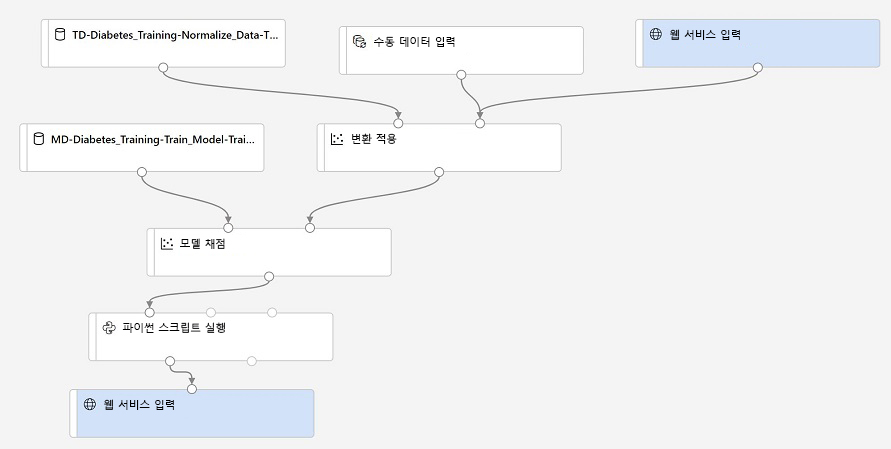

# 랩 2B: Azure ML Designer를 활용해 서비스 배포

모델 학습이 완료되었으므로 학습 파이프라인을 가져온 다음 새 데이터의 점수 매기기용 유추 파이프라인을 만드는 데 사용할 수 있습니다.

> **참고**: 이 문서를 작성하는 시점에서 Azure Machine Learning Designer는 *미리 보기* 상태입니다. 따라서 예기치 않은 오류가 발생할 수 있습니다.

## 시작하기 전에

이 랩을 시작하기 전에 [랩 1A](Lab01A.md) 및 [랩 1B](Lab01B.md)를 완료해야 합니다. 이 두 랩에는 이 랩에서 사용되는 Azure Machine Learning 작업 영역 및 기타 리소스를 만드는 작업이 포함되어 있습니다. 그리고 이 랩에서 사용되는 Designer 학습 파이프라인을 만드는 작업이 포함된 [랩 2A](Lab02A.md)도 완료해야 합니다.

## 작업 1: 유추 컴퓨팅 대상 준비

이 랩에서는 유추 파이프라인을 AKS(Azure Kubernetes Services) 클러스터에 컨테이너화된 서비스로 게시합니다. AKS 클러스터를 초기화하려면 시간이 다소 걸릴 수 있으므로 유추 파이프라인을 준비하기 전에 프로세스를 시작해야 합니다.

1. [Azure Machine Learning Studio](https://ml.azure.com)의 작업 영역 **컴퓨팅** 페이지에서 각 탭에 표시되는 기존 컴퓨팅 대상을 검토합니다. 이때 다음과 같은 정보를 검토해야 합니다.
    * **컴퓨팅 인스턴스**: 이전 랩에서 만든 컴퓨팅 인스턴스
    * **컴퓨팅 클러스터**: 이전 랩에서 만든 컴퓨팅 대상.
    * **유추 클러스터**: 아직 없음
    * **연결된 컴퓨팅**: 없음. 작업 영역 외부에 있는 가상 머신 또는 Databricks 클러스터를 연결할 수 있습니다.

2. **컴퓨팅 인스턴스** 탭에서 컴퓨팅 인스턴스가 아직 실행되고 있지 않으면 시작합니다. 이 랩의 뒷부분에서 해당 인스턴스를 사용할 것입니다.

3. **유추 클러스터** 탭에서 다음 설정을 사용하여 새 클러스터를 추가합니다.
    * **컴퓨팅 이름**: *고유한 이름 입력*
    * **Kubernetes Service**: 새로 만들기
    * **지역**: 사용 가능 지역 선택
    * **가상 머신 크기**: Standard_DS2_v2(*필터를 사용해 목록에서 이 항목을 찾을 수 있음*)
    * **클러스터 용도**: 개발-테스트
    * **노드 수**: 2
    * **네트워크 구성**: 기본
    * **SSL 구성 사용**: 선택 안 함

    > **참고**: Azure 구독에는 추가적인 지역 제한과 프로비전할 수 있는 코어 수 제한이 있을 수 있습니다. 이 랩에서는 **Dev-test** 클러스터 목적(엔드포인트를 프로덕션 클러스터에서 최소 12개 미만의 코어를 가진 클러스터에 배포할 수 있도록 허용), 그리고 **Standard_DS2_v2** 가상 머신 크기(노드당 2개의 코어를 포함하므로 두 노드가 4개의 코어만 사용)를 사용하는 것이 중요합니다.

4. 컴퓨팅 대상이 *만드는 중* 상태인지 확인하고 다음 작업을 진행합니다. 주기적으로 이 페이지를 다시 표시하여 새로 고쳐서 클러스터가 만들어지고 있는지 확인합니다.

    > **참고**: AKS 클러스터를 만드는 과정은 시간이 많이 걸릴 수 있습니다. 클러스터를 만드는 동안 오류가 발생하면 오류 발생 클러스터를 삭제하고 다른 지역을 사용하여 다시 시도하세요.

## 작업 2: 유추 파이프라인 만들기

유추 컴퓨팅을 프로비전하는 동안 배포용 유추 파이프라인을 준비할 수 있습니다.

1. **Designer** 페이지에서 이전 랩에서 만든 **시각적 당뇨병 학습** 파이프라인을 엽니다.
2. **유추 파이프라인 만들기** 드롭다운 목록에서 **실시간 유추 파이프라인**을 클릭합니다. 몇 초가 지나면 파이프라인의 새 버전인 **시각적 당뇨병 학습 - 실시간 유추**가 열립니다.
3. 새 파이프라인의 이름을 **당뇨병 예측**으로 변경하고 새 파이프라인을 검토합니다. 이 파이프라인의 일부 변환 및 학습 단계는 캡슐화되어 있습니다. 따라서 학습 데이터의 통계를 사용하여 새 데이터 값을 일반화하며, 학습된 모델을 사용하여 새 데이터의 점수를 매깁니다.
4. 유추 파이프라인은 새 데이터가 원래 학습 데이터의 스키마와 일치한다고 가정하므로, 학습 파이프라인의 **diabetes dataset** 데이터 세트가 포함됩니다. 이 입력 데이터에는 모델이 예측하는 **Diabetic** 레이블이 포함되어 있는데, 이 레이블은 당뇨병을 아직 예측하지 않은 신규 환자 데이터에 포함하기에 적합하지 않습니다.
5. 유추 파이프라인의 이 **diabetes dataset** 데이터 세트는 삭제하고 **데이터 입력 및 출력** 섹션의 **수동으로 데이터 입력** 모듈로 바꿉니다. 그러면 **웹 서비스 입력**과 같은 **변환 적용** 모듈의 동일한 **dataset** 입력에 연결됩니다. 그런 후에 다음 CSV 입력을 사용하도록 **수동으로 데이터 입력** 모듈의 설정을 수정합니다. 이 입력에는 세 가지 신규 환자 관찰 정보의 레이블이 없는 기능 값이 포함되어 있습니다.

    ```CSV
    PatientID,Pregnancies,PlasmaGlucose,DiastolicBloodPressure,TricepsThickness,SerumInsulin,BMI,DiabetesPedigree,Age
    1882185,9,104,51,7,24,27.36983156,1.350472047,43
    1662484,6,73,61,35,24,18.74367404,1.074147566,75
    1228510,4,115,50,29,243,34.69215364,0.741159926,59
    ```

6. 유추 파이프라인에 포함되어 있는 **모델 평가** 모듈은 새 데이터를 예측할 때는 유용하지 않으므로 삭제합니다.
7. **모델 점수 매기기** 모듈의 출력에는 모든 입력 기능과 예측 레이블 및 확률 점수가 포함됩니다. 
8. 예측 및 확률만 출력에 포함되도록 제한하려면, **모델 점수 매기기** 모듈과 **웹 서비스 출력** 간의 연결을 삭제하고, **Python 언어** 섹션의 **Python 스크립트 실행** 모듈을 추가합니다. 그런 다음 **모델 점수 매기기** 모듈의 출력을 **Python 스크립트 실행**의 **Dataset1**(맨 왼쪽) 입력에 연결하고, **Python 스크립트 실행** 모듈의 출력을 **웹 서비스 출력**에 연결합니다. 그러고 나서 다음 코드를 사용하도록 **Python 스크립트 실행** 모듈의 설정을 수정합니다. 기존 코드를 모두 바꿔야 합니다.

    ```Python
    import pandas as pd

    def azureml_main(dataframe1 = None, dataframe2 = None):

        scored_results = dataframe1[['PatientID', 'Scored Labels', 'Scored Probabilities']]
        scored_results.rename(columns={'Scored Labels':'DiabetesPrediction',
                                       'Scored Probabilities':'Probability'},
                              inplace=True)
        return scored_results
    ```

9. 파이프라인이 다음과 같이 표시되는지 확인합니다.

    

10. 학습에 사용한 컴퓨팅 클러스터에서 **predict-diabetes**라는 새 실험으로 파이프라인을 제출합니다. 파이프라인을 실행하려면 시간이 다소 걸릴 수 있습니다.

## 작업 3: 웹 서비스 게시

이제 실시간 유추를 위한 유추 파이프라인을 만들었으므로 클라이언트 애플리케이션이 사용하도록 웹 서비스로 게시할 수 있습니다.

1. **컴퓨팅** 페이지로 돌아간 다음 **유추 컴퓨팅** 탭에서 뷰를 새로 고쳐 유추 클러스터가 만들어졌는지 확인합니다. 유추 클러스터가 만들어지지 않았으면 만들어질 때까지 기다립니다. 이 과정은 시간이 다소 걸릴 수 있습니다.
2. **Designer** 탭으로 다시 전환한 다음 **당뇨병 예측** 유추 파이프라인을 다시 엽니다. 파이프라인의 실행이 아직 완료되지 않았으면 완료될 때까지 기다립니다. 그러고 나서 **Python 스크립트 실행** 모듈의 **결과 데이트 세트** 출력을 시각화하여 입력 데이터에 포함된 세 가지 환자 관찰 정보에 대해 예측된 레이블과 확률을 확인합니다.
3. 오른쪽 위에서 **배포**를 클릭하여 만든 유추 클러스터에서 **predict-diabetes**라는 새로운 실시간 엔드포인트를 설정합니다.
4. 웹 서비스가 배포될 때까지 기다립니다. 배포는 몇 분 정도 걸릴 수 있습니다. 배포 상태는 디자이너 인터페이스의 왼쪽 위에 표시됩니다.

    > **팁**: 서비스가 배포되기를 기다리는 동안 [https://docs.microsoft.com/azure/machine-learning/service/concept-designer](https://docs.microsoft.com/azure/machine-learning/service/concept-designer)에서 Azure Machine Learning Designer 설명서를 검토해 보세요.

## 작업 4: 웹 서비스 테스트

이제 클라이언트 애플리케이션에서 배포된 서비스를 테스트할 수 있습니다. 여기서는 Notebook VM의 Notebook을 사용해 볼 것입니다.

1. **엔드포인트** 페이지에서 **predict-diabetes** 실시간 엔드포인트를 엽니다.
2. **predict-diabetes** 엔드포인트가 열리면 **사용** 탭에서 **REST 엔드포인트** 및 **기본 키** 값을 확인합니다.
3. 다른 브라우저 탭에서 Azure Machine Learning Studio의 작업 영역 **컴퓨팅** 페이지를 엽니다. 컴퓨팅 인스턴스가 아직 실행되고 있지 않으면 인스턴스가 시작될 때까지 기다립니다. 그런 다음 **Jupyter** 링크를 클릭합니다.
4. Jupyter의 **Users/DP100** 폴더에서 **02B - Using the Visual Designer.ipynb**를 엽니다.
5. Notebook에서 **ENDPOINT** 및 **PRIMARY_KEY** 자리 표시자를 서비스의 값으로 바꿉니다. 엔드포인트 페이지의 **사용** 탭에서 이러한 값을 복사할 수 있습니다.
6. 코드 셀을 실행하여 웹 서비스에서 반환된 출력을 확인합니다.
7. Notebook에서 코드 실행이 완료되면 **파일** 메뉴에서 **닫기 및 중지**를 클릭하여 Notebook을 닫고 Python 커널을 종료합니다. 그런 후에 모든 Jupyter 브라우저 탭을 닫습니다.

## 작업 5: 웹 서비스 삭제 및 컴퓨팅 중지

웹 서비스는 Kubernetes 클러스터에서 호스트됩니다. 웹 서비스를 더 이상 실험해 보지 않으려는 경우 불필요한 Azure 요금이 청구되지 않도록 엔드포인트와 클러스터를 삭제해야 합니다. 그리고 다시 필요해질 때까지 다른 컴퓨팅 리소스도 중지해야 합니다.

1. [Azure Machine Learning Studio](https://ml.azure.com)의 **엔드포인트** 탭에서 **predict-diabetes** 엔드포인트를 선택합니다. 그런 다음 **삭제**(&#128465;) 단추를 클릭하고 엔드포인트 삭제를 확인합니다.
2. **컴퓨팅** 페이지의 **유추 클러스터** 탭에서 유추 클러스터를 선택합니다. 그런 다음 **삭제**(&#128465;) 단추를 클릭하고 컴퓨팅 대상 삭제를 확인합니다.
3. **컴퓨팅** 페이지의 **컴퓨팅 클러스터** 탭에서 컴퓨팅 클러스터를 편집하고 **최소 노드 수**를 0으로 재설정합니다.
4. Azure Machine Learning에서 작업이 완료되었으면 **컴퓨팅 인스턴스** 탭에서 컴퓨팅 인스턴스를 선택한 다음 **중지**를 클릭하여 종료합니다. 완료되지 않았다면 다음 랩을 위해 실행 상태로 둡니다.
